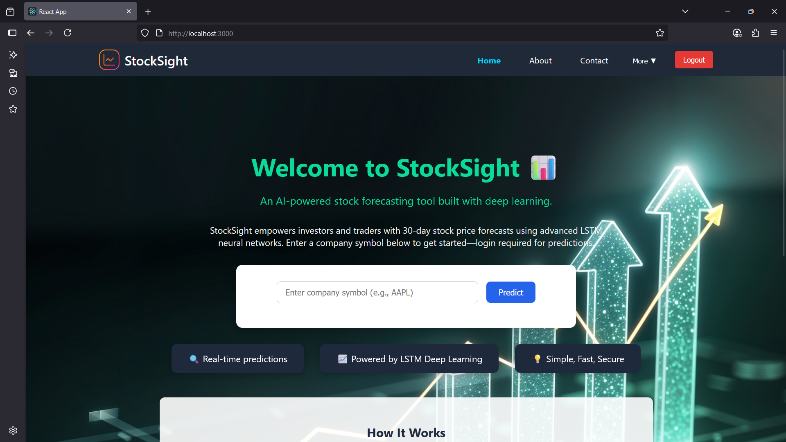

🚀 StockSight — A full-stack stock price prediction platform built with React, Flask, and MongoDB Atlas. Fetches live market data from Yahoo Finance and Tiingo API, delivers 30-day AI-powered forecasts, and lets authenticated users export predictions to CSV/PDF for deeper analysis.

---

## 📚 Table of Contents
- [About the Project](#about-the-project)
- [Built With](#built-with)
- [Project Structure](#project-structure)
- [Getting Started](#getting-started)
- [Usage](#usage)
- [Screenshots](#screenshots)
- [License](#license)
- [Acknowledgements](#acknowledgements)

---

## 📖 About the Project

**StockSight** empowers users to make informed investment decisions by predicting company stock prices for the next 30 days.  
It combines **live market data** from Yahoo Finance and the **Tiingo API** with a trained machine learning model to generate forecasts.

**Key Features:**
- 📊 **30-day stock price prediction**
- 🔄 **Live market data fetching**
- 🔒 **Secure email/password authentication**
- 📥 **Export prediction results** to CSV or PDF
- 🛡 **Restricted access** — only logged-in users can run predictions

---

## 🛠 Built With

**Frontend:**
- React
- JavaScript
- HTML5 / CSS3

**Backend:**
- Python
- Flask
- Flask-CORS
- MongoDB Atlas (via PyMongo / MongoEngine)
- yfinance
- Tiingo API

**Machine Learning & Data Processing:**
- TensorFlow / Keras
- Pandas / NumPy
- Scikit-Learn
- Matplotlib / Seaborn

**Other:**
- JWT Authentication
- CSV & PDF generation

---

Clone the repository
git clone https://github.com/your-username/StockSight.git
cd StockSight

Install dependencies
Backend:
cd server/python_model
pip install -r ../requirements.txt

Frontend:
cd ../../client
npm install

Set up environment variables
Create a .env file inside server/python_model:

MONGO_URI=your_mongodb_connection_string
TIINGO_API_KEY=your_tiingo_api_key
SECRET_KEY=your_flask_secret

Get your own keys:
MongoDB Atlas: Sign up here → Create a cluster → Get connection string
Tiingo API: Sign up here → Get API key

Start the Backend
cd server/python_model
python app.py

Start the Frontend
cd client
npm start

Access in browser:
http://localhost:3000

Note:
You must Sign up and log in to access the prediction feature.
After generating predictions, Export to CSV and Export to PDF buttons will appear alongside the forecast table.

## 🖼 Screenshots

### Home Page

### About Page

### Contact Page

### Prediction Page

### Login Page

### Signup Page

